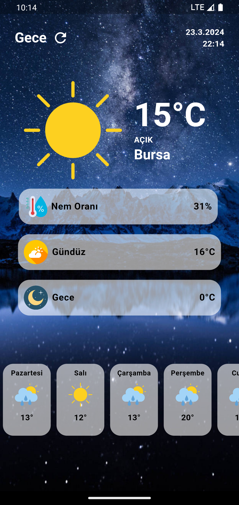

# weather_app

Flutter ile geliştirilmiş bloC pattern mimarisi kullanılarak state yönetimleri sağlanan bir mobil havadurumu uygulaması.

## Kullanılan Teknolojiler

- flutter
- restfull API
- bloC pattern

## Ekran Görüntüleri
 

 

 

 